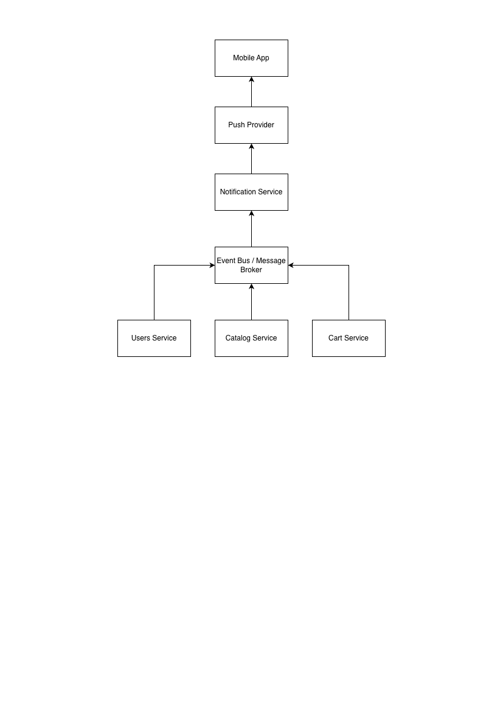

# Задание 1: Анализ требований

### Раздел ТЗ: Функционал корзины
1. Пользователь может добавить в корзину от 1 до 10 единиц одного товара.
2. Пользователь может изменить количество каждого товара в корзине не менее, чем до 1-го. Для удаления товара из корзины используется отдельная кнопка.
3. В корзине может находиться не более 5 различных товаров.
4. Суммарное количество всех товаров в корзине не может превышать 20 штук.
5. Товары в корзине могут быть разные.
6. При попытке добавить товар, превышающий лимиты, система показывает сообщение: "Лимит корзины превышен".
7. Цена на продукт фиксируется на момент добавления в корзину и не меняется.
8. На странице корзины отображается список товаров, их количество, цена за единицу и общая стоимость позиции.
9. Если пользователь уменьшает количество товара до 0, товар удаляется из корзины.
10. В корзине может быть реклама других продуктов.
11. Реклама товаров в корзине должна быть каждый будний день по утрам и вечерам.
13. Если цена на товар изменилась в каталоге, система должна автоматически обновить ее в корзине у всех пользователей.


### Найдите и перечислите все логические противоречия и недочеты в предоставленном ТЗ. Объясните, в чем заключается проблема для каждого пункта.
  1. В рамках данного раздела не указан источник добавления товара (каталог, карточка товара и т.д.), что делает сценарий добавления неполным.
  2. В пункте 2 отсутствует верхняя граница изменения количества, что делает требование неполным и потенциально противоречащим пункту 1.
  3. В пункте 2 смешаны функционал измения и удаления. Возможность удаления стоит вынести в отдельный пункт.
  4. То что в корзине может находиться не более 5 различных товаров уже значит то, что товары в корзине могут быть разными. По этому указывать это отдельно не имеет смысла. (пункты 3 и 5)
  5. Описано поведение системы при попытке добавить товар, но не описано её поведение при попытках изменить его количество. (пункт 6)
  6. В пункте 8 стоит указать ещё отображение общей стоимости всех товаров и суммарного количества всех товаров, так как у нас есть ограничение в 20шт (в пункте 4).
  7. Пункт 9 противоречит пункту 2, исходя из которого пользователь не может изменить количество товара на 0.
  8. Во всех пункта используется понятие "товар", а в пункте 10 "продукты".
  9. Нет уточнения, что из себя должна представлять реклама, указанная в пункте 10.
  10. Нет уточнения, как система должна выбирать список товаров(продуктов) для рекламы (пункт 10)
  11. В пункте 10 указано, что реклама может быть, а в пункте 11 указано, что должна быть в обозначенные промежутки времени.
  12. Нет уточнения, в какое именно время утром и вечером должна быть реклама и какой часовой пояс используется. (пункт 11)
  13. Нет уточнения, что такое будний день. Это может быть с понедельника по пятницу, а может быть рабочий день в контексте государственного производственного календаря. (пункт 11)
  14. В списке нарушена нумерация пунктов. Отсутствует пункт 12.
  15. В пункте 7 указано, что цена должна фиксироваться, а в пункте 13 что обновляться.

### Предложите конкретные исправления для устранения этих противоречий - напишите свою версию этого фрагмента ТЗ, которая должна быть логически завершенной и непротиворечивой.
  1. Пользователь может добавить от 1 до 10 единиц одного товара из каталога.
  2. Пользователь может изменить количество товаров от 1 до 10 единиц.
  3. Пользователь может удалить товар из корзины нажатием на отдельную кнопку.
  4. В корзине может находиться не более 5 различных товаров.
  5. В корзине может находиться не более 20 единиц товаров в целом.
  6. При превышении любого из лимитов система блокирует действие и отображает сообщение с ограничением, которое было превышено:
    - "Нельзя добавить больше 5 разных товаров в корзину"
    - "Общее количество единиц товаров в корзине не должно превышать 20 штук"
    - "Количество единиц одного товара должно быть от 1 до 10"
  7. На странице корзины отображается: 
    - список товаров(название, количество, цена, сумма, кнопка удаления)
    - общая стоимость всех товаров
    - общее количество товаров
  8. Система должна поддерживать отображение рекламного блока в корзине.
  9. Реклама товаров в корзине должна быть с понедельника по пятницу в промежутки времени 08:00–11:00 и 18:00–21:00 по локальному времени пользователя
  10. Цена товара в корзине обновляется вместе с ценой товара в каталоге.

### Какие уточняющие вопросы вы бы задали продукт-менеджеру или бизнес-заказчику по этому ТЗ?
  1. Почему именно такие лимиты на товары?
  2. Система должна блокировать попытку установить количество товара меньше 1 или давать возможность удалять его таким способом?
  3. Что считается различным товаром?
  4. Как должна выглядеть реклама товаров в корзине?
  5. Как система должна выбирать список товаров для рекламы?
  6. В какие именно дни и какое время утром и вечером должна быть реклама?
  7. Цена на продукт должна фиксироваться при добавлении в корзину или обновляться при изменении в каталоге?


# Задание 2: проектирование API

### Написать пример REST API запроса, который будет вызываться при переходе пользователя на данный экран.
GET /api/v1/partner-stores

### Привести пример ответа этого REST API в соответствии с макетом. Формат - JSON. Учесть, что при клике на плашку магазина должен осуществляться переход по ссылке на внешний ресурс. 
```
{
    "data": [
        {
            "id": 0,
            "name": "METRO",
            "logoUrl": "https://metro-cc.ru/svg/header-mobile-logo.svg",
            "externalUrl": "https://www.metro-cc.ru/",
            "delivery": {
                "type": "nearest",
                "from": "2026-03-03T21:00:00+03:00",
                "to": "2026-03-03T23:00:00+03:00"
            }
        },
        {
            "id": 1,
            "name": "Ашан",
            "logoUrl": "https://www.auchan.ru/svg/header-mobile-logo.svg",
            "externalUrl": "https://www.auchan.ru/",
            "delivery": {
                "type": "nearest",
                "from": "2026-03-03T18:00:00+03:00",
                "to": "2026-03-03T20:00:00+03:00"
            }
        },
        {
            "id": 2,
            "name": "ВкусВил",
            "logoUrl": "https://vkusvill.ru/svg/header-mobile-logo.svg",
            "externalUrl": "https://vkusvill.ru/",
            "delivery": {
                "type": "duration",
                "minMinutes": 20,
                "maxMinutes": 60
            }
        },
        {
            "id": 3,
            "name": "Виктория",
            "logoUrl": "https://victoria-group.ru/local/templates/victoria_new/img/logo.jpg",
            "externalUrl": "https://victoria-group.ru/",
            "delivery": {
                "type": "nearest",
                "from": "2026-03-03T17:00:00+03:00",
                "to": "2026-03-03T19:00:00+03:00"
            }
        },
    ],
    "meta": [
        "total": 4
    ]
}
```

# Задание 2: архитектура

